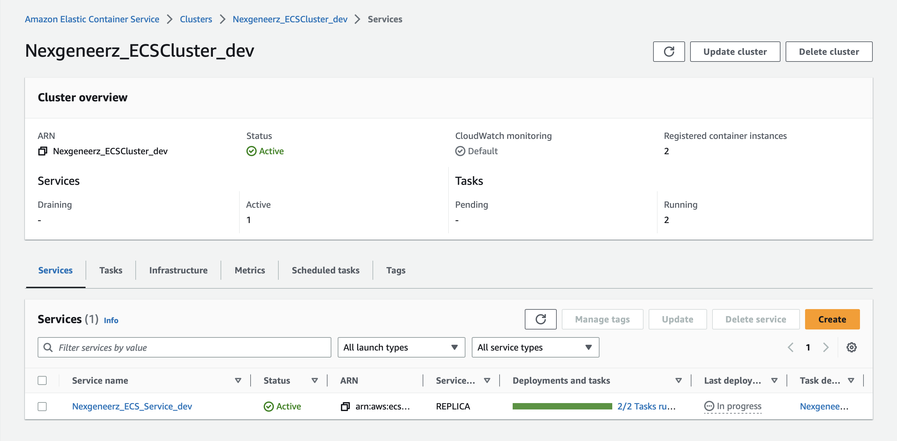
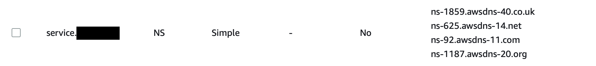

# AWS ECS on EC2 using Terraform

This sample project is part of the "Cloud Computing on AWS" article series and represents a complete, production-grade 
setup of a container-based application on ECS on EC2. [You can find the related article with in-depth 
information about this project here](https://nexgeneerz.io/aws-computing-with-ecs-ec2-terraform/).

The demo project helps you to get a basic understanding of how ECS on EC2 works and what is possible with it. 

## Before you start

> **Warning**
> 
> You may incur costs by creating resources in AWS. Therefore, always remember to use the `make destroy` command at the end to remove all resources created during this tutorial.

Please check the requirements needed for this project before you start. 

Which would be:

- Make sure you have [Docker](http://docker.com) installed on your local machine and the Docker daemon is up and running
- Install an upt-to-date version of [Terraform](http://terraform.io) on your computer
- Install the [AWS CLI](https://docs.aws.amazon.com/cli/latest/userguide/getting-started-install.html) on your machine
- Buy and setup a top level domain in your AWS account that you can use for this demonstration (This step will incur costs for you!)
- Make sure you have a Route 53 Hosted Zone for this top level domain and note down the Hosted Zone ID
- You will need an SSH public and private key 
- Make sure you have `make` installed
- Make sure you have the `openssl` package installed (used for random hash generation)

## Getting started

All commands are available via Makefile. Before you start, you need to add some definitions to the config file.
Generate the config file:

`make bootstrap`

Now set the appropriate values for the config variables:
- Set `DOMAIN_NAME` to your top level domain (TLD) at AWS, plus a subdomain you want to usee for this tutorial (for example `service.example.com`)
- Set `TLD_ZONE_ID` to the Route 53 Hosted Zone ID of your top level domain
- Set `AWS_ACCESS_KEY_ID` and `AWS_SECRET_ACCESS_KEY` with credentials with permissions to create resources in AWS
- Set `TF_VAR_public_ec2_key` with the public key of your SSH key (you must own the private key to be able to login to the EC2 instances)

- Optional: set `REGION` to use a different region (default is `eu-central-1`)

After adding these variables, you are ready to start:

```shell
make deploy
```

This command will execute the following tasks:

- Initialize Terraform
- Run the `terraform plan` command and generates a local plan file
- Run the `terraform apply` command and provisions all the ECS on EC2 resources on AWS
- Build the application Docker image and push it to ECR (the AWS Container registry)

The first time you run the deploy command and all resources are created from scratch, it can take between 5-10 minutes to finish.
When the command has finished, it might take some more minutes until ECS starts the desired amount of tasks. As long as 
the `docker push` command did not run, ECS tries to start the tasks, but fails as no Docker image is available in the registry.

> **Warning**
> 
> You should not interrupt a running Terraform command to avoid a corrupt state file.

After the process has finished, check the ECS console in your AWS account to make sure the initial task deployment has 
been finished. The ECS console should look like this:



You should now be able to see the running demo app under the domain you have configured, for example 
`dev.service.example.com` (replace `example.com` with your domain). The setup is using an HTTPS connection, even if you 
call `http://dev.service.example.com`, you are still being redirected to `https://dev.service.example.com`.

## Trigger new deployment

This demo project shows a simple React/NextJS service that serves as an example for a more complex service that can be 
integrated and deployed regularly within a CI/CD environment, including the underlying infrastructure. Each deployment 
(aka each new ECS Task version) is deployed using a rolling update approach, which means there is no downtime. 

To simulate triggering a new deployment, make some changes in the NextJS app (go to _app/src/pages/index.tsx_ and change the `<h1>` headline text) 
and run `make deploy` again. The following steps happen now:

- Potential changes in the infrastructure are provisioned
- A new task version is deployed with a different hash version number than the previous one
- The application Docker image is being build and pushed to the Elastic Container Registry (ECR)
- The existing task version will be replaced task by task

In your AWS console, you can observe the deployment process in the ECS console. The process takes some minutes to finish.

## Destroy all resources

To destroy all your resources, run the following command:
```shell
make destroy
```
This command takes some time (usually 5-10 minutes) to finish.

## FAQ

### `aws_ecs_service.service` hanging in status 'DRAINING'

Before an ECS Service can be deleted, all running tasks have to be stopped and the task definitions have to be deregistered. 
After that, the service can be deleted _without_ being in the 'DRAINING' status. The `make destroy` command normally takes 
care of all required steps to prevent this situation from happening. However, if you encounter problems, you can run `make destroy.clean` 
to run the required steps again. 

### The service DNS settings do not work

Make sure that you have bought a domain name at AWS with the correct nameserver (NS) settings. You have to use the 
Route 53 Hosted Zone ID in the Makefile for `TF_VAR_tld_zone_id`. 

Double-check in the AWS Console in Route 53 for you domain name that an NS record exists that looks something like this:



If your domain is `example.com`, the record name must be `service.example.com`.  

> **Info**
> 
> The domain names on the right might look different for your setup, which is okay.

## Known limitations

### ECS Task deployment failing because of missing Docker image/manifest

For easier setup, the deployment of the ECR repository is not separate from the deployment of the rest of the infrastructure. Thus, we need to deploy a new task version before pushing the Docker image. For a period of a few minutes between task deployment and `docker push` of the new image, we may therefore see error messages in the deployment events of the ECS Console. However, once the new Docker image has been pushed, it will be used as desired after a few minutes.
